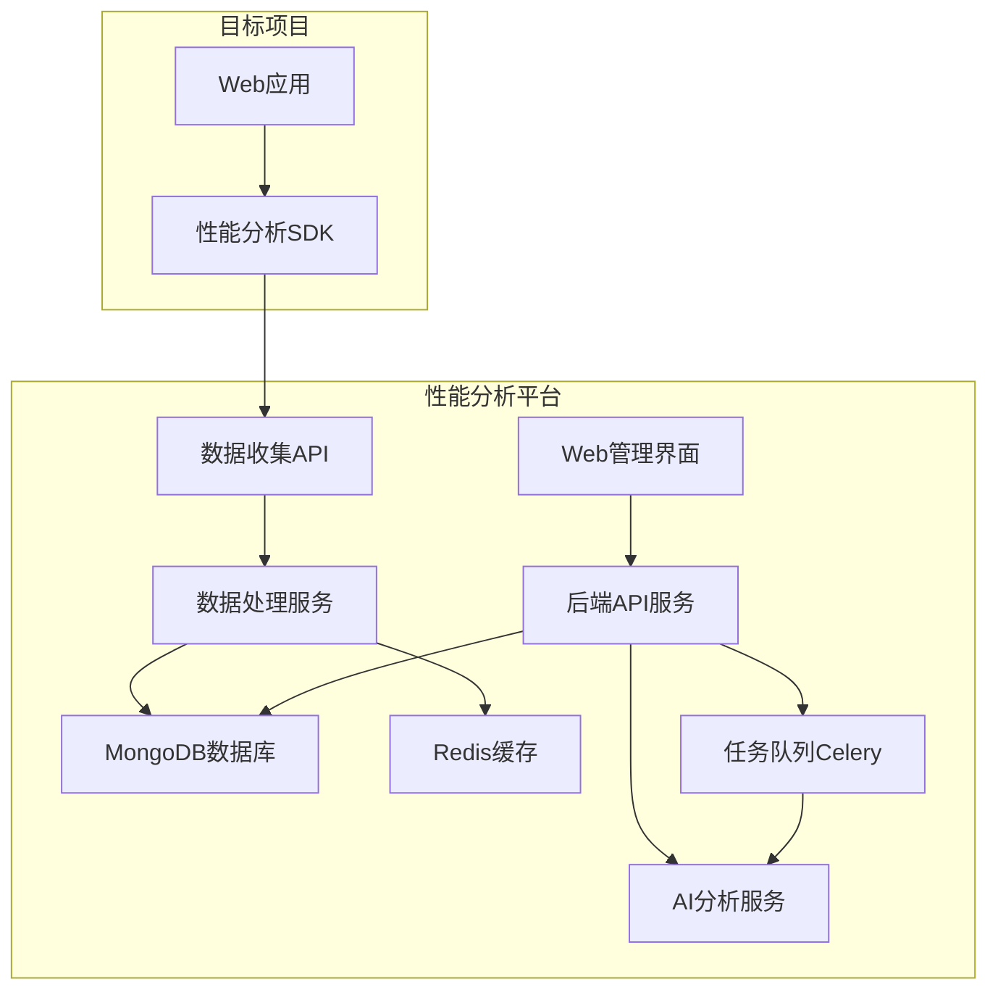
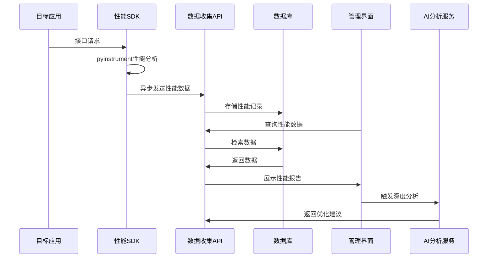
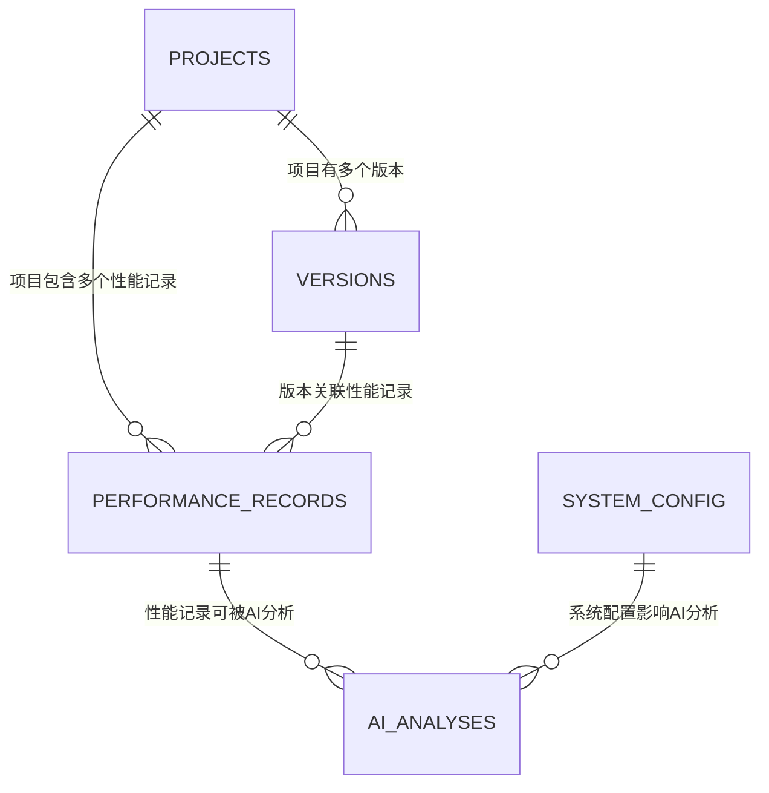
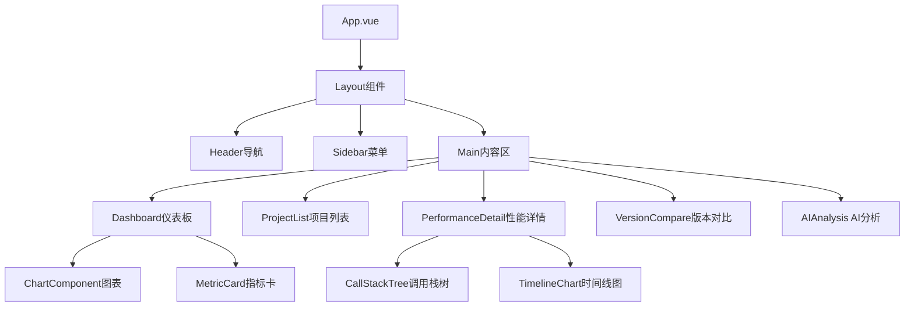
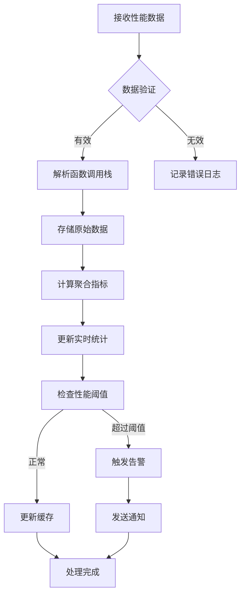
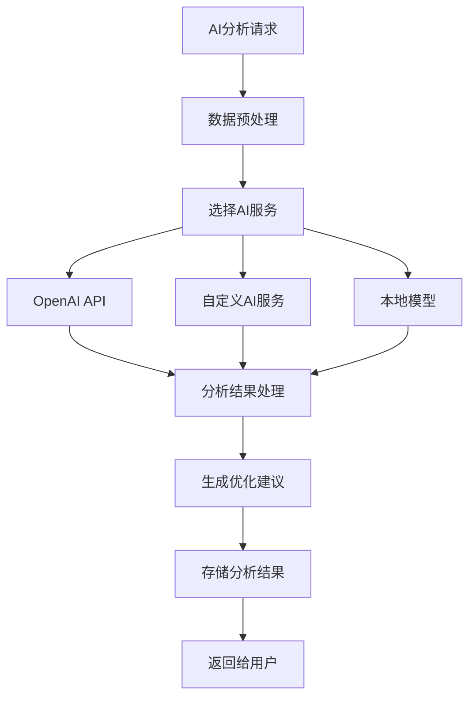
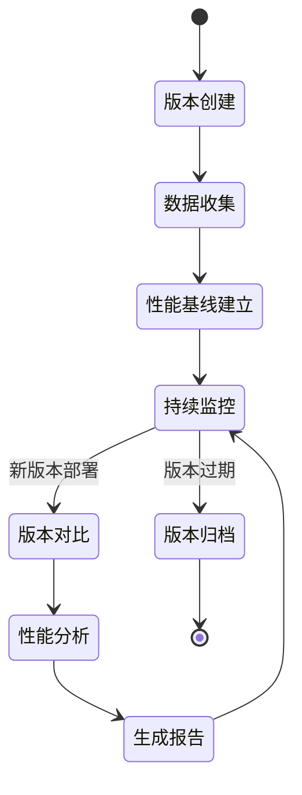

# 基于Pyinstrument的性能分析平台设计

## 1. 概述

### 1.1 项目背景
当前在Flask Web项目中手动接入pyinstrument包来分析接口性能瓶颈，需要手动分析耗时原因并进行优化。为了自动化这个过程，需要开发一个基于pyinstrument的性能分析平台。

### 1.2 核心目标
- 提供插件式的快速接入方案，支持多种项目类型
- 自动监控全平台接口性能，记录函数级执行链路
- 支持历史版本性能数据管理
- 集成AI工具进行自动化性能分析和优化建议
- 不影响目标项目的正常功能

### 1.3 技术定位
- **项目类型**: 全栈应用（后端服务 + 前端管理界面）
- **核心依赖**: pyinstrument性能分析库
- **部署方式**: 独立服务，通过SDK/插件接入目标项目

## 2. 技术栈与依赖

### 2.1 后端技术栈
- **框架**: FastAPI (高性能异步Web框架)
- **数据库**: MongoDB (主数据库，支持文档存储) + Redis (缓存)
- **性能分析**: pyinstrument
- **任务队列**: Celery + Redis
- **AI集成**: 支持OpenAI API、自定义AI服务
- **部署**: Docker + Docker Compose

### 2.2 前端技术栈
- **框架**: Vue 3 + TypeScript
- **UI组件库**: Element Plus
- **状态管理**: Pinia
- **路由**: Vue Router
- **图表可视化**: ECharts
- **HTTP客户端**: Axios
- **构建工具**: Vite
- **开发服务器**: Vite Dev Server (支持代理配置)
- **跨域解决方案**: 开发环境代理 + 生产环境CORS配置

### 2.3 SDK组件
- **Python SDK**: 支持Flask、Django、FastAPI等Web框架
- **配置管理**: YAML/JSON配置文件
- **数据传输**: HTTP REST API

### 2.4 开发环境
- **Node.js**: v24.3.0
- **npm**: 11.4.2
- **Python**: 3.9.6
- **pip3**: 25.1.1

## 3. 架构设计

### 3.1 总体架构



### 3.2 数据流架构



## 4. 核心功能模块

### 4.1 性能分析SDK - 第三方应用接入

#### 4.1.1 接入方式概览

| 接入方式 | 适用场景 | 集成难度 | 性能影响 | 推荐指数 |
|----------|----------|----------|----------|----------|
| 装饰器方式 | 函数级监控 | 低 | 最小 | ⭐⭐⭐⭐⭐ |
| 中间件方式 | Web框架全局监控 | 中 | 低 | ⭐⭐⭐⭐⭐ |
| 手动埋点 | 自定义监控点 | 高 | 可控 | ⭐⭐⭐ |
| 自动注入 | 无代码侵入 | 低 | 中 | ⭐⭐⭐⭐ |

#### 4.1.2 快速接入指南

##### 步骤1: 安装SDK
```bash
# 通过pip安装
pip install performance-monitor-sdk

# 或者通过requirements.txt
echo "performance-monitor-sdk>=1.0.0" >> requirements.txt
pip install -r requirements.txt
```

##### 步骤2: 获取项目密钥
```python
# 通过管理界面或API获取project_key
# 方式1: 访问Web管理界面创建项目
# 方式2: 通过API创建
import requests

response = requests.post('http://platform.example.com/api/v1/projects', {
    'name': '我的Web项目',
    'description': '用户管理系统API'
})
project_key = response.json()['project_key']
print(f"项目密钥: {project_key}")
```

##### 步骤3: 配置初始化
```python
# config/performance_config.py
from performance_monitor import PerformanceConfig

config = PerformanceConfig(
    project_key="your_project_key_here",
    api_endpoint="http://platform.example.com/api",
    enabled=True,
    sampling_rate=1.0,  # 生产环境建议0.1-0.3
    async_send=True,
    batch_size=50
)
```

#### 4.1.3 Flask应用接入

##### 方式1: 中间件接入（推荐）
```python
# app.py
from flask import Flask
from performance_monitor.flask import PerformanceMiddleware
from config.performance_config import config

app = Flask(__name__)

# 添加性能监控中间件
app.wsgi_app = PerformanceMiddleware(
    app.wsgi_app, 
    config=config,
    exclude_paths=['/health', '/metrics', '/static/*'],
    include_patterns=['/api/*', '/admin/*']
)

@app.route('/api/users/<int:user_id>')
def get_user(user_id):
    # 业务逻辑保持不变
    user = User.query.get(user_id)
    return jsonify(user.to_dict())

if __name__ == '__main__':
    app.run(debug=True)
```

##### 方式2: 装饰器接入
```python
# models/user.py
from performance_monitor.decorators import monitor_performance
from flask_sqlalchemy import SQLAlchemy

db = SQLAlchemy()

class User(db.Model):
    id = db.Column(db.Integer, primary_key=True)
    username = db.Column(db.String(80), unique=True)
    email = db.Column(db.String(120), unique=True)
    
    @monitor_performance(track_sql=True, track_memory=True)
    def get_user_profile(self):
        """获取用户详细信息"""
        # 模拟复杂查询
        profile = db.session.query(UserProfile).filter_by(user_id=self.id).first()
        permissions = db.session.query(Permission).join(UserRole).filter_by(user_id=self.id).all()
        
        return {
            'user': self.to_dict(),
            'profile': profile.to_dict() if profile else None,
            'permissions': [p.to_dict() for p in permissions]
        }
        permissions = db.session.query(Permission).join(UserRole).filter_by(user_id=self.id).all()
        
        return {
            'user': self.to_dict(),
            'profile': profile.to_dict() if profile else None,
            'permissions': [p.to_dict() for p in permissions]
        }
    
    @monitor_performance(custom_tags={'operation': 'user_creation'})
    def create_user(cls, username, email, password):
        """创建新用户"""
        # 数据验证
        if cls.query.filter_by(username=username).first():
            raise ValueError("用户名已存在")
        
        # 密码加密
        hashed_password = generate_password_hash(password)
        
        # 创建用户
        user = cls(username=username, email=email, password=hashed_password)
        db.session.add(user)
        db.session.commit()
        
        return user
```

##### 方式3: 手动埋点
```python
# services/user_service.py
from performance_monitor import PerformanceTracker

class UserService:
    def __init__(self):
        self.tracker = PerformanceTracker()
    
    def complex_user_operation(self, user_id):
        """复杂的用户操作示例"""
        with self.tracker.trace('complex_user_operation') as span:
            # 第一步：获取用户基本信息
            with span.trace('get_user_basic_info'):
                user = User.query.get(user_id)
                span.set_tag('user_id', user_id)
                span.set_tag('user_type', user.user_type)
            
            # 第二步：获取用户权限
            with span.trace('get_user_permissions'):
                permissions = self._get_user_permissions(user_id)
                span.set_metric('permission_count', len(permissions))
            
            # 第三步：生成用户报告
            with span.trace('generate_user_report'):
                report = self._generate_report(user, permissions)
                span.set_metric('report_size', len(report))
            
            return report
    
    def _get_user_permissions(self, user_id):
        # 模拟复杂的权限查询
        time.sleep(0.1)  # 模拟数据库查询耗时
        return ['read', 'write', 'admin']
    
    def _generate_report(self, user, permissions):
        # 模拟报告生成
        time.sleep(0.2)  # 模拟报告生成耗时
        return f"用户{user.username}的详细报告"
```

#### 4.1.4 Django应用接入

##### 中间件配置
```python
# settings.py
MIDDLEWARE = [
    'django.middleware.security.SecurityMiddleware',
    'performance_monitor.django.PerformanceMiddleware',  # 添加性能监控
    'django.contrib.sessions.middleware.SessionMiddleware',
    'django.middleware.common.CommonMiddleware',
    # ... 其他中间件
]

# 性能监控配置
PERFORMANCE_MONITOR = {
    'PROJECT_KEY': 'your_project_key_here',
    'API_ENDPOINT': 'http://platform.example.com/api',
    'ENABLED': True,
    'SAMPLING_RATE': 0.3,  # 生产环境30%采样
    'EXCLUDE_PATHS': ['/admin/jsi18n/', '/static/', '/media/'],
    'INCLUDE_PATTERNS': ['/api/', '/admin/'],
    'ASYNC_SEND': True,
    'TRACK_SQL': True,      # 跟踪SQL查询
    'TRACK_CACHE': True,    # 跟踪缓存操作
    'TRACK_TEMPLATES': True, # 跟踪模板渲染
}
```

##### Django视图监控
```python
# views.py
from django.shortcuts import render, get_object_or_404
from django.http import JsonResponse
from performance_monitor.django.decorators import monitor_view
from .models import User, UserProfile

@monitor_view(track_sql=True, track_cache=True)
def user_detail_view(request, user_id):
    """用户详情视图"""
    user = get_object_or_404(User, id=user_id)
    
    # 获取用户资料（可能触发多个SQL查询）
    profile = UserProfile.objects.select_related('user').get(user=user)
    recent_orders = user.orders.filter(created_at__gte=timezone.now() - timedelta(days=30))
    
    context = {
        'user': user,
        'profile': profile,
        'recent_orders': recent_orders,
        'order_count': recent_orders.count()
    }
    
    return render(request, 'user_detail.html', context)

@monitor_view(custom_tags={'api_version': 'v1'})
def api_user_search(request):
    """用户搜索API"""
    query = request.GET.get('q', '')
    page = int(request.GET.get('page', 1))
    page_size = int(request.GET.get('page_size', 20))
    
    if not query:
        return JsonResponse({'error': '搜索关键词不能为空'}, status=400)
    
    # 复杂的搜索逻辑
    users = User.objects.filter(
        Q(username__icontains=query) | 
        Q(email__icontains=query) |
        Q(profile__real_name__icontains=query)
    ).select_related('profile').distinct()
    
    # 分页
    paginator = Paginator(users, page_size)
    page_obj = paginator.get_page(page)
    
    return JsonResponse({
        'users': [user.to_dict() for user in page_obj],
        'total': paginator.count,
        'page': page,
        'has_next': page_obj.has_next()
    })
```

#### 4.1.5 FastAPI应用接入

##### 中间件配置
```python
# main.py
from fastapi import FastAPI, Depends
from performance_monitor.fastapi import PerformanceMiddleware
from config.performance_config import config

app = FastAPI(title="用户管理API")

# 添加性能监控中间件
app.add_middleware(
    PerformanceMiddleware,
    config=config,
    exclude_paths=["/docs", "/redoc", "/openapi.json", "/health"],
    include_patterns=["/api/v1/*"],
    track_request_body=True,
    track_response_body=False  # 避免记录敏感响应数据
)

@app.get("/api/v1/users/{user_id}")
async def get_user(user_id: int, db: Session = Depends(get_db)):
    """获取用户信息"""
    user = db.query(User).filter(User.id == user_id).first()
    if not user:
        raise HTTPException(status_code=404, detail="用户不存在")
    
    return user.to_dict()

@app.post("/api/v1/users/")
async def create_user(
    user_data: UserCreateSchema, 
    db: Session = Depends(get_db)
):
    """创建新用户"""
    # 检查用户名是否已存在
    existing_user = db.query(User).filter(User.username == user_data.username).first()
    if existing_user:
        raise HTTPException(status_code=400, detail="用户名已存在")
    
    # 创建用户
    user = User(**user_data.dict())
    db.add(user)
    db.commit()
    db.refresh(user)
    
    return user.to_dict()
```

##### 异步函数监控
```python
# services/async_user_service.py
import asyncio
from performance_monitor.asyncio import async_monitor

class AsyncUserService:
    
    @async_monitor(track_memory=True)
    async def batch_user_processing(self, user_ids: List[int]):
        """批量处理用户数据"""
        tasks = []
        
        # 创建异步任务
        for user_id in user_ids:
            task = asyncio.create_task(self.process_single_user(user_id))
            tasks.append(task)
        
        # 等待所有任务完成
        results = await asyncio.gather(*tasks, return_exceptions=True)
        
        # 处理结果
        successful = [r for r in results if not isinstance(r, Exception)]
        failed = [r for r in results if isinstance(r, Exception)]
        
        return {
            'successful_count': len(successful),
            'failed_count': len(failed),
            'results': successful
        }
    
    @async_monitor(custom_tags={'operation': 'single_user_process'})
    async def process_single_user(self, user_id: int):
        """处理单个用户"""
        # 模拟异步数据库操作
        await asyncio.sleep(0.1)
        
        # 模拟外部API调用
        async with aiohttp.ClientSession() as session:
            async with session.get(f'http://external-api.com/users/{user_id}') as resp:
                external_data = await resp.json()
        
        # 模拟数据处理
        await asyncio.sleep(0.05)
        
        return {
            'user_id': user_id,
            'processed_at': datetime.now(),
            'external_data': external_data
        }
```

#### 4.1.6 高级配置选项

##### 环境变量配置
```bash
# .env 文件
PERFORMANCE_MONITOR_PROJECT_KEY=your_project_key
PERFORMANCE_MONITOR_API_ENDPOINT=http://platform.example.com/api
PERFORMANCE_MONITOR_ENABLED=true
PERFORMANCE_MONITOR_SAMPLING_RATE=0.3
PERFORMANCE_MONITOR_ASYNC_SEND=true
PERFORMANCE_MONITOR_LOG_LEVEL=INFO
```

##### YAML配置文件
```yaml
# performance_config.yaml
performance_monitor:
  project_key: "${PERFORMANCE_MONITOR_PROJECT_KEY}"
  api_endpoint: "${PERFORMANCE_MONITOR_API_ENDPOINT}"
  enabled: true
  
  # 采样配置
  sampling:
    rate: 0.3                    # 基础采样率
    error_rate: 1.0              # 错误请求100%采样
    slow_request_threshold: 1.0   # 慢请求阈值（秒）
    slow_request_rate: 1.0       # 慢请求100%采样
  
  # 过滤配置
  filters:
    exclude_paths:
      - "/health"
      - "/metrics"
      - "/static/*"
      - "*.css"
      - "*.js"
      - "*.ico"
    include_patterns:
      - "/api/*"
      - "/admin/*"
    exclude_methods:
      - "OPTIONS"
    max_request_size: 10485760   # 10MB
    max_response_size: 10485760  # 10MB
  
  # 数据传输配置
  transport:
    async_send: true
    batch_size: 50
    batch_timeout: 5.0           # 批量发送超时（秒）
    retry_times: 3
    retry_delay: 1.0
    compression: true
  
  # 监控项配置
  tracking:
    sql_queries: true
    external_requests: true
    cache_operations: true
    memory_usage: true
    cpu_usage: false             # CPU监控可能影响性能
    template_rendering: true
    custom_metrics: true
  
  # 告警配置
  alerts:
    response_time_threshold: 2.0  # 响应时间告警阈值（秒）
    error_rate_threshold: 0.05    # 错误率告警阈值
    memory_threshold: 512         # 内存使用告警阈值（MB）
  
  # 日志配置
  logging:
    level: INFO
    format: "[%(asctime)s] %(levelname)s - %(name)s - %(message)s"
    file: "/var/log/performance_monitor.log"
    max_size: 104857600          # 100MB
    backup_count: 5
```

##### 动态配置更新
```python
# utils/config_manager.py
from performance_monitor import ConfigManager

class DynamicConfigManager:
    def __init__(self, project_key):
        self.config_manager = ConfigManager(project_key)
        self.current_config = self.load_config()
    
    def load_config(self):
        """从远程加载配置"""
        try:
            remote_config = self.config_manager.fetch_remote_config()
            return remote_config
        except Exception as e:
            logger.warning(f"无法获取远程配置，使用本地配置: {e}")
            return self.config_manager.get_local_config()
    
    def update_config(self, new_config):
        """更新配置"""
        self.current_config.update(new_config)
        self.config_manager.save_local_config(self.current_config)
        
        # 通知所有监控实例更新配置
        self.config_manager.notify_config_change()
    
    def get_sampling_rate(self, endpoint, method):
        """根据端点动态获取采样率"""
        endpoint_config = self.current_config.get('endpoint_configs', {})
        specific_config = endpoint_config.get(f"{method} {endpoint}")
        
        if specific_config:
            return specific_config.get('sampling_rate', self.current_config['sampling']['rate'])
        
        return self.current_config['sampling']['rate']
```

#### 4.1.7 接入验证和测试

##### 接入验证脚本
```python
# scripts/verify_integration.py
import requests
import time
from performance_monitor import PerformanceTracker

def verify_integration(project_key, api_endpoint):
    """验证SDK接入是否成功"""
    print("🚀 开始验证性能监控集成...")
    
    # 1. 测试配置连接
    try:
        response = requests.get(f"{api_endpoint}/health")
        if response.status_code == 200:
            print("✅ API连接正常")
        else:
            print("❌ API连接失败")
            return False
    except Exception as e:
        print(f"❌ API连接异常: {e}")
        return False
    
    # 2. 测试数据发送
    tracker = PerformanceTracker(project_key=project_key, api_endpoint=api_endpoint)
    
    with tracker.trace('test_integration') as span:
        span.set_tag('test_type', 'integration_verification')
        time.sleep(0.1)  # 模拟一些处理时间
        span.set_metric('test_value', 42)
    
    # 等待数据发送
    time.sleep(2)
    
    # 3. 验证数据是否到达
    try:
        verify_response = requests.get(
            f"{api_endpoint}/v1/performance/records",
            params={'project_key': project_key, 'limit': 1}
        )
        
        if verify_response.status_code == 200:
            records = verify_response.json()
            if records['data'] and len(records['data']['items']) > 0:
                print("✅ 数据发送成功")
                return True
            else:
                print("❌ 未找到性能数据")
                return False
        else:
            print("❌ 数据验证失败")
            return False
    except Exception as e:
        print(f"❌ 数据验证异常: {e}")
        return False

if __name__ == "__main__":
    project_key = "your_project_key_here"
    api_endpoint = "http://platform.example.com/api"
    
    success = verify_integration(project_key, api_endpoint)
    if success:
        print("🎉 性能监控集成验证成功！")
    else:
        print("😞 性能监控集成验证失败，请检查配置")
    
    # 等待数据发送
    time.sleep(2)
    
    # 3. 验证数据是否到达
    try:
        verify_response = requests.get(
            f"{api_endpoint}/v1/performance/records",
            params={'project_key': project_key, 'limit': 1}
        )
        
        if verify_response.status_code == 200:
            records = verify_response.json()
            if records['data'] and len(records['data']) > 0:
                print("✅ 数据发送成功")
                return True
            else:
                print("❌ 未找到性能数据")
                return False
        else:
            print("❌ 数据验证失败")
            return False
    except Exception as e:
        print(f"❌ 数据验证异常: {e}")
        return False

if __name__ == "__main__":
    project_key = "your_project_key_here"
    api_endpoint = "http://platform.example.com/api"
    
    success = verify_integration(project_key, api_endpoint)
    if success:
        print("🎉 性能监控集成验证成功！")
    else:
        print("😞 性能监控集成验证失败，请检查配置")
```

##### 性能影响测试
```python
# scripts/performance_impact_test.py
import time
import statistics
from functools import wraps

def measure_performance_impact():
    """测量SDK对应用性能的影响"""
    
    def test_function_without_monitoring():
        """不使用监控的测试函数"""
        time.sleep(0.01)  # 模拟业务逻辑
        return "result"
    
    @monitor_performance()
    def test_function_with_monitoring():
        """使用监控的测试函数"""
        time.sleep(0.01)  # 模拟业务逻辑
        return "result"
    
    # 预热
    for _ in range(10):
        test_function_without_monitoring()
        test_function_with_monitoring()
    
    # 测试不使用监控的性能
    without_monitoring_times = []
    for _ in range(100):
        start = time.perf_counter()
        test_function_without_monitoring()
        end = time.perf_counter()
        without_monitoring_times.append(end - start)
    
    # 测试使用监控的性能
    with_monitoring_times = []
    for _ in range(100):
        start = time.perf_counter()
        test_function_with_monitoring()
        end = time.perf_counter()
        with_monitoring_times.append(end - start)
    
    # 计算统计数据
    without_avg = statistics.mean(without_monitoring_times)
    with_avg = statistics.mean(with_monitoring_times)
    overhead = (with_avg - without_avg) / without_avg * 100
    
    print(f"不使用监控平均耗时: {without_avg:.6f}秒")
    print(f"使用监控平均耗时: {with_avg:.6f}秒")
    print(f"性能开销: {overhead:.2f}%")
    
    if overhead < 5.0:
        print("✅ 性能开销在可接受范围内")
    elif overhead < 10.0:
        print("⚠️ 性能开销略高，建议调整采样率")
    else:
        print("❌ 性能开销过高，需要优化配置")

if __name__ == "__main__":
    measure_performance_impact()
```

### 4.2 数据收集API

#### 4.2.1 性能数据接收 (V1版本)
```python
# API端点设计 - 无认证版本
POST /api/v1/performance/records
{
    "project_key": "项目标识符",  # 简单的项目标识
    "request_id": "uuid", 
    "endpoint": "/api/users",
    "method": "GET",
    "duration": 1.234,
    "timestamp": "2024-01-01T10:00:00Z",
    "function_calls": [
        {
            "function": "get_user_by_id",
            "duration": 0.456,
            "file": "models/user.py",
            "line": 25,
            "children": [
                {
                    "function": "db_query",
                    "duration": 0.234,
                    "file": "db/connection.py",
                    "line": 15
                }
            ]
        }
    ],
    "metadata": {
        "version": "v1.2.0",
        "environment": "production"
    }
}
```

#### 4.2.2 批量数据处理
- 异步队列处理大量性能数据
- 数据聚合和统计分析
- 实时性能指标计算
- MongoDB文档存储优化

### 4.3 数据模型设计

#### 4.3.1 核心数据集合概览

| 集合名 | 用途描述 | 主要功能 |
|---------|----------|----------|
| projects | 项目管理 | 存储接入的项目信息，管理项目配置和API密钥 |
| performance_records | 性能数据记录 | 存储每次接口调用的性能分析数据，包含完整的函数调用链 |
| versions | 版本管理 | 管理项目的版本信息，支持版本间的性能对比分析 |
| ai_analyses | AI分析结果 | 存储AI对性能瓶颈的分析结果和优化建议 |
| system_config | 系统配置 | 存储平台的全局配置信息，如AI服务配置等 |

#### 4.3.2 详细数据模型

##### 4.3.2.1 projects（项目集合）
**用途**: 管理接入平台的项目信息，每个项目对应一个独立的应用系统

```javascript
{
  "_id": ObjectId("..."),           // 项目唯一标识
  "name": "用户管理系统",              // 项目名称
  "project_key": "user_mgmt_001",    // 项目访问密钥，用于SDK认证
  "description": "用户管理模块的API",   // 项目描述
  "status": "active",               // 项目状态：active/inactive/archived
  "created_at": ISODate("2024-01-01T10:00:00Z"), // 创建时间
  "updated_at": ISODate("2024-01-01T10:00:00Z"), // 更新时间
  "config": {
    "sampling_rate": 1.0,            // 采样率（0.0-1.0）
    "exclude_paths": [               // 排除监控的路径列表
      "/health",
      "/metrics"
    ],
    "include_patterns": [             // 包含监控的路径模式
      "/api/*",
      "/admin/*"
    ],
    "alert_thresholds": {             // 告警阈值配置
      "response_time": 1000,          // 响应时间阈值（毫秒）
      "error_rate": 0.05,             // 错误率阈值
      "memory_usage": 500             // 内存使用阈值（MB）
    },
    "retention_days": 30              // 数据保留天数
  },
  "statistics": {                    // 项目统计信息
    "total_requests": 12500,          // 总请求数
    "avg_response_time": 245.6,      // 平均响应时间（毫秒）
    "last_request_time": ISODate("2024-01-15T15:30:00Z") // 最后请求时间
  }
}
```

##### 4.3.2.2 performance_records（性能记录集合）
**用途**: 存储每次API调用的详细性能分析数据，包含完整的函数执行链路

```javascript
{
  "_id": ObjectId("..."),           // 记录唯一标识
  "project_id": ObjectId("..."),    // 关联的项目ID
  "request_id": "req_20240115_001", // 请求唯一标识
  "endpoint": "/api/users/123",      // 接口端点
  "method": "GET",                  // HTTP方法
  "status_code": 200,               // HTTP状态码
  "duration": 1.234,                // 总耗时（秒）
  "timestamp": ISODate("2024-01-15T10:00:00Z"), // 请求时间
  "version": "v1.2.0",              // 应用版本
  "environment": "production",       // 运行环境
  "server_info": {                  // 服务器信息
    "hostname": "api-server-01",     // 主机名
    "pid": 12345,                    // 进程ID
    "memory_usage": 256.7,           // 内存使用量（MB）
    "cpu_usage": 45.2               // CPU使用率（%）
  },
  "request_info": {                 // 请求信息
    "user_agent": "Mozilla/5.0...",  // 用户代理
    "ip_address": "192.168.1.100",   // 客户端IP
    "request_size": 1024,            // 请求大小（bytes）
    "response_size": 2048,           // 响应大小（bytes）
    "headers": {                     // 关键请求头
      "content-type": "application/json",
      "authorization": "Bearer ***"
    }
  },
  "function_calls": [               // 函数调用链（核心性能数据）
    {
      "function": "get_user_by_id",   // 函数名
      "module": "models.user",        // 模块名
      "file": "models/user.py",       // 文件路径
      "line": 25,                     // 行号
      "duration": 0.456,             // 函数耗时（秒）
      "calls_count": 1,              // 调用次数
      "memory_delta": 12.5,          // 内存变化（MB）
      "children": [                  // 子函数调用
        {
          "function": "validate_user_id",
          "module": "utils.validation",
          "file": "utils/validation.py",
          "line": 15,
          "duration": 0.012,
          "calls_count": 1,
          "children": []
        },
        {
          "function": "db_query",
          "module": "db.connection",
          "file": "db/connection.py",
          "line": 45,
          "duration": 0.234,
          "calls_count": 1,
          "sql": "SELECT * FROM users WHERE id = %s",
          "children": [
            {
              "function": "execute_query",
              "module": "sqlalchemy.engine",
              "file": "sqlalchemy/engine/base.py",
              "line": 1234,
              "duration": 0.198,
              "calls_count": 1,
              "children": []
            }
          ]
        }
      ]
    }
  ],
  "database_queries": [              // 数据库查询汇总
    {
      "query": "SELECT * FROM users WHERE id = %s",
      "duration": 0.198,
      "rows_affected": 1,
      "query_type": "SELECT"
    }
  ],
  "external_calls": [               // 外部服务调用
    {
      "service": "user_service",
      "url": "http://internal-api/users/123",
      "method": "GET",
      "duration": 0.123,
      "status_code": 200
    }
  ],
  "errors": [],                     // 错误信息列表
  "warnings": [],                   // 警告信息列表
  "created_at": ISODate("2024-01-15T10:00:00Z") // 记录创建时间
}
```

##### 4.3.2.3 versions（版本管理集合）
**用途**: 管理项目的版本信息，支持不同版本间的性能对比分析

```javascript
{
  "_id": ObjectId("..."),           // 版本记录唯一标识
  "project_id": ObjectId("..."),    // 关联的项目ID
  "version": "v1.2.0",              // 版本号
  "version_name": "用户模块优化版本",   // 版本名称
  "description": "优化了用户查询性能",  // 版本描述
  "deployed_at": ISODate("2024-01-15T09:00:00Z"), // 部署时间
  "created_at": ISODate("2024-01-15T08:00:00Z"),  // 创建时间
  "status": "active",               // 版本状态：active/inactive/archived
  "git_info": {                     // Git信息
    "commit_hash": "abc123def456",   // 提交哈希
    "branch": "main",               // 分支名
    "author": "developer@example.com", // 作者
    "commit_message": "优化数据库查询性能" // 提交信息
  },
  "performance_baseline": {         // 性能基线数据
    "avg_response_time": 245.6,      // 平均响应时间（毫秒）
    "p95_response_time": 456.7,      // 95%响应时间（毫秒）
    "p99_response_time": 789.1,      // 99%响应时间（毫秒）
    "error_rate": 0.02,              // 错误率
    "throughput": 120.5,             // 吞吐量（req/s）
    "total_requests": 5000,          // 统计请求总数
    "calculation_period": {          // 统计周期
      "start": ISODate("2024-01-15T09:00:00Z"),
      "end": ISODate("2024-01-16T09:00:00Z")
    }
  },
  "metadata": {                     // 元数据
    "deployment_type": "rolling",    // 部署类型
    "environment": "production",     // 环境
    "infrastructure": {             // 基础设施信息
      "server_count": 3,
      "database_version": "PostgreSQL 14.2",
      "python_version": "3.9.6"
    }
  }
}
```

##### 4.3.2.4 ai_analyses（AI分析结果集合）
**用途**: 存储AI对性能瓶颈的智能分析结果和优化建议

```javascript
{
  "_id": ObjectId("..."),           // 分析记录唯一标识
  "project_id": ObjectId("..."),    // 关联的项目ID
  "record_id": ObjectId("..."),     // 关联的性能记录ID
  "analysis_type": "performance_bottleneck", // 分析类型
  "ai_service": "openai_gpt4",      // 使用的AI服务
  "status": "completed",            // 分析状态：pending/processing/completed/failed
  "created_at": ISODate("2024-01-15T10:30:00Z"), // 创建时间
  "completed_at": ISODate("2024-01-15T10:32:00Z"), // 完成时间
  "analysis_duration": 2.5,         // 分析耗时（秒）
  "input_data": {                   // 输入数据摘要
    "endpoint": "/api/users/123",
    "total_duration": 1.234,
    "main_bottlenecks": [
      "db_query: 0.234s",
      "data_processing: 0.456s"
    ]
  },
  "analysis_result": {              // 分析结果
    "bottleneck_summary": "数据库查询是主要性能瓶颈",
    "severity_level": "medium",       // 严重程度：low/medium/high/critical
    "confidence_score": 0.85,        // 置信度（0.0-1.0）
    "bottlenecks": [                 // 具体瓶颈分析
      {
        "function": "db_query",
        "file": "db/connection.py",
        "duration": 0.234,
        "percentage": 18.9,           // 占总耗时百分比
        "issue_type": "database_performance",
        "description": "数据库查询缺少索引，导致全表扫描",
        "impact_level": "high"
      },
      {
        "function": "get_user_by_id",
        "file": "models/user.py",
        "duration": 0.456,
        "percentage": 36.9,
        "issue_type": "algorithm_inefficiency",
        "description": "用户数据处理算法效率较低",
        "impact_level": "medium"
      }
    ]
  },
  "suggestions": [                  // 优化建议
    {
      "priority": "high",            // 优先级：low/medium/high/critical
      "category": "database_optimization", // 建议类别
      "title": "添加数据库索引",
      "description": "为users表的id字段添加索引，提高查询性能",
      "implementation": {
        "code_example": "CREATE INDEX idx_users_id ON users(id);",
        "estimated_effort": "1 hour",  // 预估工作量
        "expected_improvement": "减少60%查询时间" // 预期改进效果
      },
      "references": [               // 参考资料
        "https://docs.example.com/database-indexing"
      ]
    },
    {
      "priority": "medium",
      "category": "code_optimization",
      "title": "优化数据处理算法",
      "description": "使用更高效的数据处理方式，减少循环嵌套",
      "implementation": {
        "code_example": "# 使用列表推导式替代多层循环\nresult = [process(item) for item in data]",
        "estimated_effort": "2 hours",
        "expected_improvement": "减少30%处理时间"
      }
    }
  ],
  "metrics": {                      // 分析指标
    "tokens_used": 1500,            // AI服务使用的token数
    "cost": 0.03,                   // 分析成本（美元）
    "processing_time": 2.1          // AI处理时间（秒）
  },
  "feedback": {                     // 用户反馈
    "rating": 4,                    // 评分（1-5）
    "useful": true,                 // 是否有用
    "comment": "建议很实用，已采纳并实施", // 用户评论
    "feedback_time": ISODate("2024-01-16T09:00:00Z")
  }
}
```

##### 4.3.2.5 system_config（系统配置集合）
**用途**: 存储平台的全局配置信息，如AI服务配置、系统参数等

```javascript
{
  "_id": ObjectId("..."),           // 配置记录唯一标识
  "config_key": "ai_service_config", // 配置项键名
  "config_name": "AI服务配置",       // 配置项名称
  "description": "AI分析服务的相关配置", // 配置描述
  "config_value": {                // 配置值
    "default_service": "openai",     // 默认AI服务
    "services": {
      "openai": {
        "api_key": "sk-***",         // API密钥（加密存储）
        "model": "gpt-4",            // 使用的模型
        "max_tokens": 2000,          // 最大token数
        "temperature": 0.7,          // 温度参数
        "enabled": true              // 是否启用
      },
      "custom_ai": {
        "endpoint": "http://ai.internal.com/api",
        "api_key": "custom_key",
        "enabled": false
      }
    },
    "analysis_settings": {
      "auto_analyze_threshold": 1.0, // 自动分析阈值（秒）
      "max_daily_analyses": 100,    // 每日最大分析次数
      "retry_failed_analyses": true  // 是否重试失败的分析
    }
  },
  "created_at": ISODate("2024-01-01T00:00:00Z"), // 创建时间
  "updated_at": ISODate("2024-01-15T10:00:00Z"), // 更新时间
  "updated_by": "admin",            // 更新者
  "version": 1                      // 配置版本号
}
```

#### 4.3.3 数据关系说明



#### 4.3.4 索引设计

为了优化查询性能，需要创建以下索引：

```javascript
// projects集合索引
db.projects.createIndex({ "project_key": 1 }, { unique: true })
db.projects.createIndex({ "status": 1 })
db.projects.createIndex({ "created_at": -1 })

// performance_records集合索引
db.performance_records.createIndex({ "project_id": 1, "timestamp": -1 })
db.performance_records.createIndex({ "endpoint": 1, "method": 1 })
db.performance_records.createIndex({ "duration": -1 })
db.performance_records.createIndex({ "version": 1 })
db.performance_records.createIndex({ "timestamp": -1 })

// versions集合索引
db.versions.createIndex({ "project_id": 1, "version": 1 }, { unique: true })
db.versions.createIndex({ "deployed_at": -1 })

// ai_analyses集合索引
db.ai_analyses.createIndex({ "record_id": 1 })
db.ai_analyses.createIndex({ "project_id": 1, "created_at": -1 })
db.ai_analyses.createIndex({ "status": 1 })

// system_config集合索引
db.system_config.createIndex({ "config_key": 1 }, { unique: true })
```

### 4.4 Web管理界面 (V1版本)

#### 4.4.1 主要页面结构
- **仪表板**: 性能概览、趋势图表
- **项目管理**: 项目列表、配置管理 (无用户管理)
- **性能监控**: 接口性能详情、函数调用链
- **版本对比**: 历史版本性能对比
- **AI分析**: 自动化分析结果和优化建议

#### 4.4.2 组件层次结构



#### 4.4.3 跨域问题解决方案

##### 4.4.3.1 开发环境代理配置

**Vite配置文件 (vite.config.ts)**
```typescript
import { defineConfig } from 'vite'
import vue from '@vitejs/plugin-vue'
import { resolve } from 'path'

export default defineConfig({
  plugins: [vue()],
  resolve: {
    alias: {
      '@': resolve(__dirname, 'src')
    }
  },
  server: {
    port: 3000,
    host: '0.0.0.0',
    proxy: {
      // 代理API请求到后端服务
      '/api': {
        target: 'http://localhost:8000',  // 后端服务地址
        changeOrigin: true,
        secure: false,
        rewrite: (path) => path.replace(/^\/api/, '/api'),
        configure: (proxy, options) => {
          proxy.on('error', (err, req, res) => {
            console.log('proxy error', err);
          });
          proxy.on('proxyReq', (proxyReq, req, res) => {
            console.log('Sending Request to the Target:', req.method, req.url);
          });
          proxy.on('proxyRes', (proxyRes, req, res) => {
            console.log('Received Response from the Target:', proxyRes.statusCode, req.url);
          });
        }
      },
      // WebSocket代理（如果需要实时通信）
      '/ws': {
        target: 'ws://localhost:8000',
        ws: true,
        changeOrigin: true
      }
    }
  },
  build: {
    outDir: 'dist',
    sourcemap: true,
    rollupOptions: {
      output: {
        manualChunks: {
          vendor: ['vue', 'vue-router', 'pinia'],
          ui: ['element-plus'],
          charts: ['echarts']
        }
      }
    }
  }
})
```

##### 4.4.3.2 环境配置管理

**环境变量配置**
```bash
# .env.development (开发环境)
VITE_APP_TITLE=性能分析平台
VITE_API_BASE_URL=/api
VITE_APP_ENV=development
VITE_ENABLE_MOCK=false

# .env.production (生产环境)
VITE_APP_TITLE=性能分析平台
VITE_API_BASE_URL=https://api.performance-platform.com/api
VITE_APP_ENV=production
VITE_ENABLE_MOCK=false

# .env.staging (测试环境)
VITE_APP_TITLE=性能分析平台-测试
VITE_API_BASE_URL=https://staging-api.performance-platform.com/api
VITE_APP_ENV=staging
VITE_ENABLE_MOCK=false

# .env.production (生产环境)
VITE_APP_TITLE=性能分析平台
VITE_API_BASE_URL=https://api.performance-platform.com/api
VITE_APP_ENV=production
VITE_ENABLE_MOCK=false

# .env.staging (测试环境)
VITE_APP_TITLE=性能分析平台-测试
VITE_API_BASE_URL=https://staging-api.performance-platform.com/api
VITE_APP_ENV=staging
VITE_ENABLE_MOCK=false
```

**环境配置封装**
```typescript
// src/config/env.ts
interface ImportMetaEnv {
  readonly VITE_APP_TITLE: string
  readonly VITE_API_BASE_URL: string
  readonly VITE_APP_ENV: 'development' | 'production' | 'staging'
  readonly VITE_ENABLE_MOCK: string
}

interface ImportMeta {
  readonly env: ImportMetaEnv
}

export const config = {
  appTitle: import.meta.env.VITE_APP_TITLE,
  apiBaseUrl: import.meta.env.VITE_API_BASE_URL,
  appEnv: import.meta.env.VITE_APP_ENV,
  enableMock: import.meta.env.VITE_ENABLE_MOCK === 'true',
  isDevelopment: import.meta.env.VITE_APP_ENV === 'development',
  isProduction: import.meta.env.VITE_APP_ENV === 'production',
  isStaging: import.meta.env.VITE_APP_ENV === 'staging'
}
```

##### 4.4.3.3 HTTP客户端配置

**Axios封装配置**
```typescript
// src/utils/request.ts
import axios, { AxiosInstance, AxiosRequestConfig, AxiosResponse } from 'axios'
import { ElMessage, ElMessageBox } from 'element-plus'
import { config } from '@/config/env'

// 响应数据类型
interface ApiResponse<T = any> {
  code: number
  msg: string
  data: T
}

// 创建Axios实例
const service: AxiosInstance = axios.create({
  baseURL: config.apiBaseUrl,
  timeout: 10000,
  headers: {
    'Content-Type': 'application/json;charset=UTF-8'
  }
})

// 请求拦截器
service.interceptors.request.use(
  (config: AxiosRequestConfig) => {
    // 添加请求时间戳
    if (config.params) {
      config.params._t = Date.now()
    } else {
      config.params = { _t: Date.now() }
    }

    // 开发环境日志
    if (config.isDevelopment) {
      console.log('🚀 API Request:', {
        url: config.url,
        method: config.method,
        params: config.params,
        data: config.data
      })
    }

    return config
  },
  (error) => {
    console.error('请求拦截器错误:', error)
    return Promise.reject(error)
  }
)

// 响应拦截器
service.interceptors.response.use(
  (response: AxiosResponse<ApiResponse>) => {
    const { data } = response
    
    // 开发环境日志
    if (config.isDevelopment) {
      console.log('📨 API Response:', {
        url: response.config.url,
        status: response.status,
        data: data
      })
    }

    // 判断响应状态
    if (data.code === 0) {
      return data
    } else {
      // 处理业务错误
      handleBusinessError(data.code, data.msg)
      return Promise.reject(new Error(data.msg))
    }
  },
  (error) => {
    // 处理HTTP错误
    handleHttpError(error)
    return Promise.reject(error)
  }
)

// 处理业务错误
function handleBusinessError(code: number, message: string) {
  switch (code) {
    case 1000:
      ElMessage.error('参数错误')
      break
    case 1001:
      ElMessage.error('资源不存在')
      break
    case 2001:
      ElMessage.error('项目密钥无效')
      break
    case 4001:
      ElMessage.error('AI服务不可用')
      break
    default:
      ElMessage.error(message || '未知错误')
  }
}

// 处理HTTP错误
function handleHttpError(error: any) {
  let message = '请求失败'
  
  if (error.response) {
    const status = error.response.status
    switch (status) {
      case 400:
        message = '请求参数错误'
        break
      case 401:
        message = '未授权，请重新登录'
        break
      case 403:
        message = '禁止访问'
        break
      case 404:
        message = '请求资源不存在'
        break
      case 500:
        message = '服务器内部错误'
        break
      case 502:
        message = '网关错误'
        break
      case 503:
        message = '服务不可用'
        break
      default:
        message = `连接错误: ${status}`
    }
  } else if (error.request) {
    message = '网络连接异常'
  }
  
  ElMessage.error(message)
}

export default service
export type { ApiResponse }
```

##### 4.4.3.4 API服务封装

**API服务模块**
```typescript
// src/api/types.ts
export interface Project {
  id: string
  name: string
  project_key: string
  description: string
  status: 'active' | 'inactive' | 'archived'
  created_at: string
  updated_at: string
  statistics: {
    total_requests: number
    avg_response_time: number
  }
}

export interface PerformanceRecord {
  id: string
  endpoint: string
  method: string
  duration: number
  status_code: number
  timestamp: string
  version: string
  environment: string
}

export interface PaginationResponse<T> {
  items: T[]
  pagination: {
    page: number
    page_size: number
    total: number
    total_pages: number
    has_next: boolean
    has_prev: boolean
  }
}

// src/api/project.ts
import request, { ApiResponse } from '@/utils/request'
import type { Project, PaginationResponse } from './types'

// 项目管理API
export const projectApi = {
  // 获取项目列表
  getProjects(params: {
    page?: number
    page_size?: number
    status?: string
  }): Promise<ApiResponse<PaginationResponse<Project>>> {
    return request({
      url: '/v1/projects',
      method: 'GET',
      params
    })
  },

  // 创建项目
  createProject(data: {
    name: string
    description?: string
    config?: any
  }): Promise<ApiResponse<Project>> {
    return request({
      url: '/v1/projects',
      method: 'POST',
      data
    })
  },

  // 获取项目详情
  getProject(projectKey: string): Promise<ApiResponse<Project>> {
    return request({
      url: `/v1/projects/${projectKey}`,
      method: 'GET'
    })
  },

  // 更新项目
  updateProject(projectKey: string, data: Partial<Project>): Promise<ApiResponse<Project>> {
    return request({
      url: `/v1/projects/${projectKey}`,
      method: 'PUT',
      data
    })
  },

  // 删除项目
  deleteProject(projectKey: string): Promise<ApiResponse<{}>> {
    return request({
      url: `/v1/projects/${projectKey}`,
      method: 'DELETE'
    })
  }
}
```

##### 4.4.3.5 生产环境部署配置

**Nginx配置示例**
```nginx
# /etc/nginx/sites-available/performance-platform
server {
    listen 80;
    server_name performance-platform.com;
    
    # 前端静态资源
    location / {
        root /var/www/performance-platform/dist;
        index index.html;
        try_files $uri $uri/ /index.html;
        
        # 静态资源缓存
        location ~* \.(js|css|png|jpg|jpeg|gif|ico|svg)$ {
            expires 1y;
            add_header Cache-Control "public, no-transform";
        }
    }
    
    # API代理到后端服务
    location /api/ {
        proxy_pass http://backend-service:8000/api/;
        proxy_set_header Host $host;
        proxy_set_header X-Real-IP $remote_addr;
        proxy_set_header X-Forwarded-For $proxy_add_x_forwarded_for;
        proxy_set_header X-Forwarded-Proto $scheme;
        
        # CORS头（如果后端未配置）
        add_header Access-Control-Allow-Origin *;
        add_header Access-Control-Allow-Methods 'GET, POST, PUT, DELETE, OPTIONS';
        add_header Access-Control-Allow-Headers 'Content-Type, Authorization';
        
        # 处理OPTIONS请求
        if ($request_method = 'OPTIONS') {
            return 204;
        }
    }
    
    # WebSocket代理（如果需要）
    location /ws/ {
        proxy_pass http://backend-service:8000/ws/;
        proxy_http_version 1.1;
        proxy_set_header Upgrade $http_upgrade;
        proxy_set_header Connection "upgrade";
        proxy_set_header Host $host;
    }
}
```

**Docker Compose配置**
```yaml
# docker-compose.yml
version: '3.8'

services:
  frontend:
    build:
      context: ./frontend
      dockerfile: Dockerfile
    ports:
      - "3000:80"
    depends_on:
      - backend
    environment:
      - NGINX_HOST=performance-platform.com
    volumes:
      - ./nginx.conf:/etc/nginx/nginx.conf

  backend:
    build:
      context: ./backend
      dockerfile: Dockerfile
    ports:
      - "8000:8000"
    environment:
      - CORS_ORIGINS=http://localhost:3000,https://performance-platform.com
    depends_on:
      - mongodb
      - redis

  mongodb:
    image: mongo:5.0
    ports:
      - "27017:27017"
    volumes:
      - mongodb_data:/data/db
    environment:
      - MONGO_INITDB_ROOT_USERNAME=admin
      - MONGO_INITDB_ROOT_PASSWORD=password

  redis:
    image: redis:7-alpine
    ports:
      - "6379:6379"
    volumes:
      - redis_data:/data

volumes:
  mongodb_data:
  redis_data:
```

## 5. API接口设计 (V1版本 - 无认证)

### 5.1 统一响应格式

#### 5.1.1 响应体结构
所有API接口统一使用以下响应格式：

```typescript
interface ApiResponse<T> {
  code: number;     // 状态码，0表示成功，非0表示错误
  msg: string;      // 响应消息
  data: T;          // 响应数据
}
```

#### 5.1.2 成功响应示例
```json
{
  "code": 0,
  "msg": "success",
  "data": {
    "id": "64a1b2c3d4e5f6789",
    "project_key": "user_mgmt_001",
    "name": "用户管理系统",
    "created_at": "2024-01-15T10:00:00Z"
  }
}
```

#### 5.1.3 错误响应示例
```json
{
  "code": 1001,
  "msg": "项目不存在",
  "data": {}
}
```

#### 5.1.4 分页响应示例
```json
{
  "code": 0,
  "msg": "success",
  "data": {
    "items": [
      {
        "id": "64a1b2c3d4e5f6789",
        "endpoint": "/api/users/123",
        "duration": 1.234,
        "timestamp": "2024-01-15T10:00:00Z"
      }
    ],
    "pagination": {
      "page": 1,
      "page_size": 20,
      "total": 100,
      "total_pages": 5,
      "has_next": true,
      "has_prev": false
    }
  }
}
```

### 5.2 错误码定义

#### 5.2.1 通用错误码 (1000-1999)
| 错误码 | 错误消息 | 描述 |
|--------|----------|------|
| 0 | success | 请求成功 |
| 1000 | 参数错误 | 请求参数格式或内容错误 |
| 1001 | 资源不存在 | 请求的资源不存在 |
| 1002 | 资源已存在 | 创建的资源已存在 |
| 1003 | 权限不足 | 没有访问该资源的权限 |
| 1004 | 请求频率过高 | 请求频率超过限制 |
| 1005 | 服务内部错误 | 服务器内部错误 |
| 1006 | 数据库错误 | 数据库操作失败 |
| 1007 | 外部服务错误 | 调用外部服务失败 |
| 1008 | 配置错误 | 系统配置错误 |
| 1009 | 数据格式错误 | 数据格式不符合要求 |
| 1010 | 操作超时 | 操作执行超时 |

#### 5.2.2 项目管理错误码 (2000-2999)
| 错误码 | 错误消息 | 描述 |
|--------|----------|------|
| 2001 | 项目密钥无效 | project_key不正确或已失效 |
| 2002 | 项目名称重复 | 项目名称已被使用 |
| 2003 | 项目配置错误 | 项目配置参数错误 |
| 2004 | 项目状态无效 | 项目状态不支持当前操作 |
| 2005 | 项目达到上限 | 项目数量达到限制 |

#### 5.2.3 性能数据错误码 (3000-3999)
| 错误码 | 错误消息 | 描述 |
|--------|----------|------|
| 3001 | 性能数据格式错误 | 上报的性能数据格式不正确 |
| 3002 | 数据量过大 | 单次上报的数据量超过限制 |
| 3003 | 时间戳无效 | 时间戳格式错误或超出范围 |
| 3004 | 函数调用栈深度超限 | 函数调用栈层级过深 |
| 3005 | 数据已过期 | 数据超过保留期限 |

#### 5.2.4 AI分析错误码 (4000-4999)
| 错误码 | 错误消息 | 描述 |
|--------|----------|------|
| 4001 | AI服务不可用 | AI分析服务暂时不可用 |
| 4002 | 分析请求过于频繁 | AI分析请求频率过高 |
| 4003 | 分析数据不足 | 性能数据不足以进行AI分析 |
| 4004 | AI配置错误 | AI服务配置错误 |
| 4005 | 分析超时 | AI分析处理超时 |
| 4006 | 分析额度不足 | AI分析次数已达上限 |

### 5.3 项目管理API

#### 5.3.1 创建项目
```http
POST /api/v1/projects
Content-Type: application/json

{
  "name": "用户管理系统",
  "description": "用户管理模块的API",
  "config": {
    "sampling_rate": 0.3,
    "exclude_paths": ["/health"],
    "alert_thresholds": {
      "response_time": 1000
    }
  }
}
```

**成功响应:**
```json
{
  "code": 0,
  "msg": "success",
  "data": {
    "id": "64a1b2c3d4e5f6789",
    "name": "用户管理系统",
    "project_key": "user_mgmt_20240115_001",
    "description": "用户管理模块的API",
    "status": "active",
    "created_at": "2024-01-15T10:00:00Z",
    "config": {
      "sampling_rate": 0.3,
      "exclude_paths": ["/health"],
      "alert_thresholds": {
        "response_time": 1000
      }
    }
  }
}
```

**错误响应:**
```json
{
  "code": 2002,
  "msg": "项目名称重复",
  "data": {}
}
```

#### 5.3.2 获取项目列表
```http
GET /api/v1/projects?page=1&page_size=20&status=active
```

**成功响应:**
```json
{
  "code": 0,
  "msg": "success",
  "data": {
    "items": [
      {
        "id": "64a1b2c3d4e5f6789",
        "name": "用户管理系统",
        "project_key": "user_mgmt_001",
        "status": "active",
        "created_at": "2024-01-15T10:00:00Z",
        "statistics": {
          "total_requests": 12500,
          "avg_response_time": 245.6
        }
      }
    ],
    "pagination": {
      "page": 1,
      "page_size": 20,
      "total": 1,
      "total_pages": 1,
      "has_next": false,
      "has_prev": false
    }
  }
}
```

#### 5.3.3 获取项目详情
```http
GET /api/v1/projects/{project_key}
```

**成功响应:**
```json
{
  "code": 0,
  "msg": "success",
  "data": {
    "id": "64a1b2c3d4e5f6789",
    "name": "用户管理系统",
    "project_key": "user_mgmt_001",
    "description": "用户管理模块的API",
    "status": "active",
    "created_at": "2024-01-15T10:00:00Z",
    "updated_at": "2024-01-15T15:30:00Z",
    "config": {
      "sampling_rate": 0.3,
      "exclude_paths": ["/health", "/metrics"],
      "include_patterns": ["/api/*"],
      "alert_thresholds": {
        "response_time": 1000,
        "error_rate": 0.05
      }
    },
    "statistics": {
      "total_requests": 12500,
      "avg_response_time": 245.6,
      "p95_response_time": 456.7,
      "error_rate": 0.02,
      "last_request_time": "2024-01-15T15:25:00Z"
    }
  }
}
```

**错误响应:**
```json
{
  "code": 2001,
  "msg": "项目密钥无效",
  "data": {}
}
```

### 5.4 性能数据API

#### 5.4.1 上报性能数据
```http
POST /api/v1/performance/records
Content-Type: application/json

{
  "project_key": "user_mgmt_001",
  "request_id": "req_20240115_001",
  "endpoint": "/api/users/123",
  "method": "GET",
  "duration": 1.234,
  "timestamp": "2024-01-15T10:00:00Z",
  "function_calls": [
    {
      "function": "get_user_by_id",
      "duration": 0.456,
      "file": "models/user.py",
      "line": 25
    }
  ]
}
```

**成功响应:**
```json
{
  "code": 0,
  "msg": "success",
  "data": {
    "record_id": "64a1b2c3d4e5f6789",
    "processed_at": "2024-01-15T10:00:01Z"
  }
}
```

#### 5.4.2 获取性能记录列表
```http
GET /api/v1/performance/records?project_key=user_mgmt_001&page=1&page_size=20&start_time=2024-01-15T00:00:00Z&end_time=2024-01-15T23:59:59Z
```

**成功响应:**
```json
{
  "code": 0,
  "msg": "success",
  "data": {
    "items": [
      {
        "id": "64a1b2c3d4e5f6789",
        "endpoint": "/api/users/123",
        "method": "GET",
        "duration": 1.234,
        "status_code": 200,
        "timestamp": "2024-01-15T10:00:00Z",
        "version": "v1.2.0",
        "environment": "production"
      }
    ],
    "pagination": {
      "page": 1,
      "page_size": 20,
      "total": 100,
      "total_pages": 5,
      "has_next": true,
      "has_prev": false
    }
  }
}
```

#### 5.4.3 获取性能统计数据
```http
GET /api/v1/performance/stats?project_key=user_mgmt_001&period=24h&group_by=endpoint
```

**成功响应:**
```json
{
  "code": 0,
  "msg": "success",
  "data": {
    "period": {
      "start": "2024-01-14T10:00:00Z",
      "end": "2024-01-15T10:00:00Z"
    },
    "overall_stats": {
      "total_requests": 5000,
      "avg_response_time": 245.6,
      "p95_response_time": 456.7,
      "p99_response_time": 789.1,
      "error_rate": 0.02,
      "throughput": 120.5
    },
    "endpoint_stats": [
      {
        "endpoint": "/api/users/{id}",
        "method": "GET",
        "request_count": 1500,
        "avg_response_time": 189.2,
        "p95_response_time": 345.6,
        "error_rate": 0.01,
        "slowest_functions": [
          {
            "function": "get_user_by_id",
            "avg_duration": 0.156,
            "call_count": 1500
          }
        ]
      }
    ]
  }
}
```

### 5.5 AI分析API

#### 5.5.1 触发AI分析
```http
POST /api/v1/ai/analyze
Content-Type: application/json

{
  "record_id": "64a1b2c3d4e5f6789",
  "analysis_type": "performance_bottleneck"
}
```

**成功响应:**
```json
{
  "code": 0,
  "msg": "success",
  "data": {
    "analysis_id": "64a1b2c3d4e5f6790",
    "status": "processing",
    "estimated_completion": "2024-01-15T10:02:00Z"
  }
}
```

#### 5.5.2 获取分析结果
```http
GET /api/v1/ai/analyses/{analysis_id}
```

**成功响应:**
```json
{
  "code": 0,
  "msg": "success",
  "data": {
    "id": "64a1b2c3d4e5f6790",
    "status": "completed",
    "analysis_type": "performance_bottleneck",
    "created_at": "2024-01-15T10:00:00Z",
    "completed_at": "2024-01-15T10:01:30Z",
    "analysis_result": {
      "bottleneck_summary": "数据库查询是主要性能瓶颈",
      "severity_level": "medium",
      "confidence_score": 0.85,
      "bottlenecks": [
        {
          "function": "db_query",
          "file": "db/connection.py",
          "duration": 0.234,
          "percentage": 18.9,
          "issue_type": "database_performance",
          "description": "数据库查询缺少索引，导致全表扫描"
        }
      ]
    },
    "suggestions": [
      {
        "priority": "high",
        "category": "database_optimization",
        "title": "添加数据库索引",
        "description": "为users表的id字段添加索引，提高查询性能",
        "implementation": {
          "code_example": "CREATE INDEX idx_users_id ON users(id);",
          "estimated_effort": "1 hour",
          "expected_improvement": "减少60%查询时间"
        }
      }
    ]
  }
}
```

### 5.6 版本管理API

#### 5.6.1 获取版本列表
```http
GET /api/v1/versions?project_key=user_mgmt_001&page=1&page_size=10
```

**成功响应:**
```json
{
  "code": 0,
  "msg": "success",
  "data": {
    "items": [
      {
        "id": "64a1b2c3d4e5f6791",
        "version": "v1.2.0",
        "version_name": "用户模块优化版本",
        "deployed_at": "2024-01-15T09:00:00Z",
        "status": "active",
        "performance_baseline": {
          "avg_response_time": 245.6,
          "p95_response_time": 456.7,
          "error_rate": 0.02,
          "total_requests": 5000
        }
      }
    ],
    "pagination": {
      "page": 1,
      "page_size": 10,
      "total": 5,
      "total_pages": 1,
      "has_next": false,
      "has_prev": false
    }
  }
}
```

#### 5.6.2 版本对比
```http
GET /api/v1/versions/compare?project_key=user_mgmt_001&from_version=v1.1.0&to_version=v1.2.0
```

**成功响应:**
```json
{
  "code": 0,
  "msg": "success",
  "data": {
    "comparison": {
      "from_version": {
        "version": "v1.1.0",
        "avg_response_time": 312.4,
        "p95_response_time": 567.8,
        "error_rate": 0.035
      },
      "to_version": {
        "version": "v1.2.0",
        "avg_response_time": 245.6,
        "p95_response_time": 456.7,
        "error_rate": 0.02
      },
      "improvements": {
        "avg_response_time_improvement": "-21.4%",
        "p95_response_time_improvement": "-19.6%",
        "error_rate_improvement": "-42.9%"
      },
      "summary": "v1.2.0版本相比v1.1.0在各项性能指标上都有显著提升"
    }
  }
}
```

## 6. 业务逻辑层

### 6.1 性能数据处理流程



### 6.2 AI分析服务架构



### 6.3 版本管理机制



## 7. 中间件与拦截器

### 7.1 性能监控中间件
- **请求拦截**: 在请求开始时启动性能分析
- **响应拦截**: 在响应结束时收集性能数据
- **异常处理**: 处理分析过程中的异常情况
- **数据过滤**: 根据配置过滤不需要监控的请求

### 7.2 数据传输中间件
- **数据压缩**: 压缩性能数据减少传输开销
- **重试机制**: 网络异常时的重试策略
- **批量发送**: 批量发送数据提高效率
- **本地缓存**: 网络不可用时的本地缓存

## 8. 测试策略

### 8.1 单元测试
- **SDK测试**: 各种框架集成的单元测试
- **API测试**: 后端API接口的单元测试
- **组件测试**: 前端组件的单元测试
- **工具函数测试**: 性能分析工具函数测试
- **MongoDB操作测试**: 数据存储和查询逻辑测试

### 8.2 集成测试
- **端到端测试**: 从SDK到Web界面的完整流程测试
- **性能测试**: 平台本身的性能测试
- **兼容性测试**: 不同Python版本和框架的兼容性测试
- **数据一致性测试**: MongoDB数据存储和查询的一致性测试