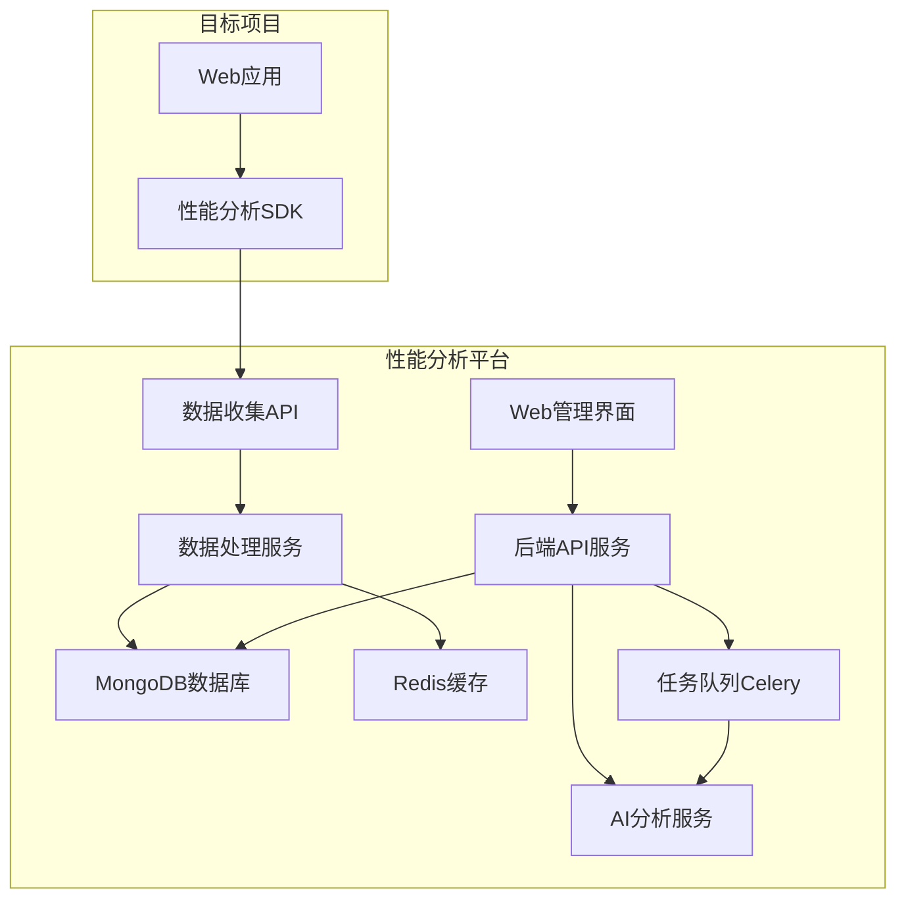
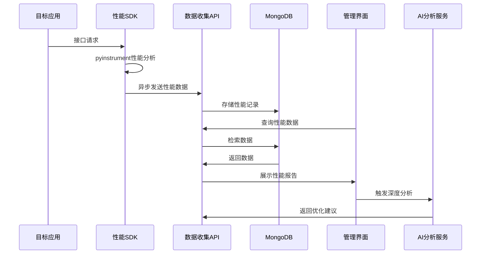

# 基于Pyinstrument的性能分析平台设计文档（优化版）

## 1. 概述

### 1.1 项目背景
当前在Flask Web项目中手动接入pyinstrument包来分析接口性能瓶颈，需要手动分析耗时原因并进行优化。为了自动化这个过程，需要开发一个基于pyinstrument的性能分析平台。

### 1.2 核心目标
- 提供插件式的快速接入方案，支持多种项目类型
- 自动监控全平台接口性能，记录函数级执行链路
- 支持历史版本性能数据管理
- 集成AI工具进行自动化性能分析和优化建议
- 不影响目标项目的正常功能和响应对象

### 1.3 技术定位
- **项目类型**: 全栈应用（后端服务 + 前端管理界面）
- **核心依赖**: pyinstrument性能分析库
- **部署方式**: 独立服务，通过SDK/插件接入目标项目

## 2. 技术栈与依赖

### 2.1 后端技术栈
- **框架**: FastAPI (高性能异步Web框架)
- **数据库**: MongoDB (主数据库，支持文档存储) + Redis (缓存)
- **性能分析**: pyinstrument
- **任务队列**: Celery + Redis
- **AI集成**: 支持OpenAI API、自定义AI服务
- **部署**: Docker + Docker Compose

### 2.2 前端技术栈
- **框架**: Vue 3 + TypeScript
- **UI组件库**: Element Plus
- **状态管理**: Pinia
- **路由**: Vue Router
- **图表可视化**: ECharts
- **HTTP客户端**: Axios
- **构建工具**: Vite
- **开发服务器**: Vite Dev Server (支持代理配置)
- **跨域解决方案**: 开发环境代理 + 生产环境CORS配置

### 2.3 SDK组件
- **Python SDK**: 支持Flask、Django、FastAPI等Web框架
- **配置管理**: YAML/JSON配置文件
- **数据传输**: HTTP REST API

### 2.4 开发环境
- **Node.js**: v24.3.0
- **npm**: 11.4.2
- **Python**: 3.9.6
- **pip3**: 25.1.1

## 3. 架构设计

### 3.1 总体架构



### 3.2 数据流架构



## 4. 核心功能模块

### 4.1 统一响应体封装

#### 4.1.1 响应体结构设计
```python
# 标准响应体结构
{
    "code": 0,           # 状态码：0-成功，非0-失败
    "msg": "success",    # 消息描述
    "data": {}           # 业务数据
}

# 成功响应示例
{
    "code": 0,
    "msg": "success",
    "data": {
        "projects": [
            {
                "id": "project_123",
                "name": "用户管理系统",
                "created_at": "2024-08-24T10:00:00Z"
            }
        ]
    }
}

# 错误响应示例
{
    "code": 10001,
    "msg": "项目不存在",
    "data": {}
}
```

#### 4.1.2 错误码设计
```python
# 系统级错误码
SUCCESS = 0                    # 成功
SYSTEM_ERROR = 10000          # 系统错误
PARAMETER_ERROR = 10001       # 参数错误
AUTHENTICATION_ERROR = 10002  # 认证错误
PERMISSION_ERROR = 10003      # 权限错误
RATE_LIMIT_ERROR = 10004      # 频率限制
DATABASE_ERROR = 10005        # 数据库错误

# 业务级错误码
PROJECT_NOT_FOUND = 20001     # 项目不存在
PROJECT_NAME_EXISTS = 20002   # 项目名称已存在
INVALID_PROJECT_KEY = 20003   # 无效的项目密钥
PERFORMANCE_DATA_INVALID = 20004  # 性能数据无效
AI_SERVICE_UNAVAILABLE = 20005    # AI服务不可用
ANALYSIS_IN_PROGRESS = 20006      # 分析正在进行中
```

### 4.2 跨域问题解决方案

#### 4.2.1 开发环境配置（Vite代理）
```typescript
// vite.config.ts
import { defineConfig } from 'vite'
import vue from '@vitejs/plugin-vue'

export default defineConfig({
  plugins: [vue()],
  server: {
    host: '0.0.0.0',
    port: 3000,
    proxy: {
      '/api': {
        target: 'http://localhost:8000',
        changeOrigin: true,
        secure: false,
        configure: (proxy, options) => {
          proxy.on('error', (err, req, res) => {
            console.log('proxy error', err);
          });
          proxy.on('proxyReq', (proxyReq, req, res) => {
            console.log('Sending Request:', req.method, req.url);
          });
          proxy.on('proxyRes', (proxyRes, req, res) => {
            console.log('Received Response:', proxyRes.statusCode, req.url);
          });
        }
      }
    }
  }
})
```

#### 4.2.2 生产环境CORS配置
```python
# backend/app/middleware/cors.py
from fastapi import FastAPI
from fastapi.middleware.cors import CORSMiddleware

def setup_cors(app: FastAPI):
    app.add_middleware(
        CORSMiddleware,
        allow_origins=[
            "http://localhost:3000",
            "http://127.0.0.1:3000",
            "https://performance-monitor.yourdomain.com"
        ],
        allow_credentials=True,
        allow_methods=["GET", "POST", "PUT", "DELETE", "OPTIONS"],
        allow_headers=["*"],
        expose_headers=["*"]
    )
```