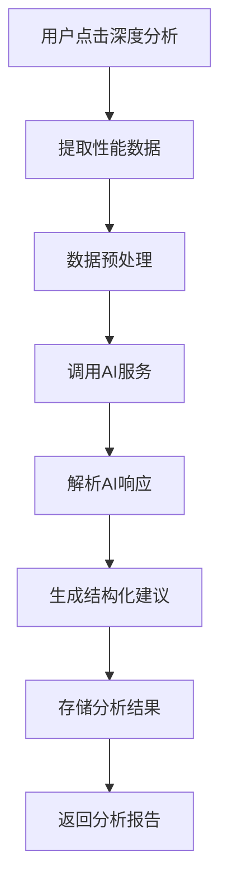

## 4.5 AI分析服务集成

### 4.5.1 AI服务配置
```python
# AI服务配置示例
{
    "ai_services": {
        "openai": {
            "provider": "openai",
            "api_key": "${OPENAI_API_KEY}",
            "model": "gpt-4",
            "endpoint": "https://api.openai.com/v1/chat/completions",
            "max_tokens": 4000,
            "temperature": 0.3
        },
        "custom_service": {
            "provider": "custom",
            "endpoint": "http://your-ai-service.com/analyze",
            "headers": {
                "Authorization": "Bearer ${CUSTOM_AI_TOKEN}"
            },
            "timeout": 30
        }
    },
    "default_service": "openai",
    "analysis_templates": {
        "performance_analysis": "分析以下性能数据，识别瓶颈并提供优化建议...",
        "bottleneck_detection": "识别以下调用链路中的性能瓶颈..."
    }
}
```

### 4.5.2 AI分析工作流


## 5. API接口设计

### 5.1 项目管理接口

#### 5.1.1 创建项目
```
POST /api/v1/projects
Content-Type: application/json

Request:
{
    "name": "用户管理系统",
    "description": "主要负责用户注册、登录等功能",
    "framework": "flask"
}

Response:
{
    "code": 0,
    "msg": "success",
    "data": {
        "project_key": "proj_abc123def456",
        "name": "用户管理系统",
        "status": "active",
        "created_at": "2024-08-24T10:00:00Z"
    }
}
```

#### 5.1.2 获取项目列表
```
GET /api/v1/projects?page=1&size=10

Response:
{
    "code": 0,
    "msg": "success",
    "data": {
        "projects": [
            {
                "project_key": "proj_abc123def456",
                "name": "用户管理系统",
                "framework": "flask",
                "status": "active",
                "last_activity": "2024-08-24T09:30:00Z"
            }
        ],
        "total": 1,
        "page": 1,
        "size": 10
    }
}
```

### 5.2 性能数据接口

#### 5.2.1 性能数据上报
```
POST /api/v1/performance/collect
Content-Type: application/json
X-Project-Key: proj_abc123def456

Request:
{
    "trace_id": "trace_xyz789",
    "request_info": {
        "method": "GET",
        "path": "/api/users/123",
        "query_params": {},
        "headers": {"User-Agent": "..."}
    },
    "performance_metrics": {
        "total_duration": 0.856,
        "cpu_time": 0.234,
        "memory_usage": {"peak_memory": 45}
    },
    "function_calls": [...]
}

Response:
{
    "code": 0,
    "msg": "success",
    "data": {
        "trace_id": "trace_xyz789",
        "recorded_at": "2024-08-24T10:15:00Z"
    }
}
```

#### 5.2.2 查询性能记录
```
GET /api/v1/performance/records?project_key=proj_abc123def456&page=1&size=20

Response:
{
    "code": 0,
    "msg": "success",
    "data": {
        "records": [
            {
                "trace_id": "trace_xyz789",
                "request_path": "/api/users/123",
                "duration": 0.856,
                "status_code": 200,
                "timestamp": "2024-08-24T10:15:00Z"
            }
        ],
        "total": 45,
        "page": 1,
        "size": 20
    }
}
```

### 5.3 AI分析接口

#### 5.3.1 触发AI分析
```
POST /api/v1/analysis/trigger
Content-Type: application/json

Request:
{
    "trace_id": "trace_xyz789",
    "analysis_type": "manual",
    "ai_service": "openai"
}

Response:
{
    "code": 0,
    "msg": "success",
    "data": {
        "analysis_id": "analysis_abc123",
        "status": "pending",
        "estimated_duration": 30
    }
}
```

#### 5.3.2 获取分析结果
```
GET /api/v1/analysis/results/analysis_abc123

Response:
{
    "code": 0,
    "msg": "success",
    "data": {
        "analysis_id": "analysis_abc123",
        "status": "completed",
        "performance_score": 72.5,
        "bottleneck_analysis": [
            {
                "type": "database",
                "severity": "high",
                "function": "get_user_profile",
                "description": "数据库查询耗时过长",
                "impact": 0.65
            }
        ],
        "optimization_suggestions": [
            {
                "category": "database",
                "priority": "high",
                "title": "添加数据库索引",
                "description": "为user_id字段添加索引可显著提升查询性能",
                "expected_improvement": "预计可减少60%的查询时间"
            }
        ]
    }
}
```

## 6. 项目目录结构

```
pystrument/
├── backend/                    # 后端服务
│   ├── app/
│   │   ├── __init__.py
│   │   ├── main.py            # FastAPI应用入口
│   │   ├── config/            # 配置管理
│   │   │   ├── __init__.py
│   │   │   ├── settings.py    # 应用配置
│   │   │   └── database.py    # 数据库配置
│   │   ├── middleware/        # 中间件
│   │   │   ├── __init__.py
│   │   │   ├── cors.py        # CORS配置
│   │   │   └── response.py    # 统一响应封装
│   │   ├── models/            # 数据模型
│   │   │   ├── __init__.py
│   │   │   ├── project.py     # 项目模型
│   │   │   ├── performance.py # 性能记录模型
│   │   │   └── analysis.py    # AI分析模型
│   │   ├── api/              # API路由
│   │   │   ├── __init__.py
│   │   │   ├── v1/
│   │   │   │   ├── __init__.py
│   │   │   │   ├── projects.py    # 项目管理接口
│   │   │   │   ├── performance.py # 性能数据接口
│   │   │   │   └── analysis.py    # AI分析接口
│   │   ├── services/         # 业务服务
│   │   │   ├── __init__.py
│   │   │   ├── project_service.py
│   │   │   ├── performance_service.py
│   │   │   └── ai_service.py
│   │   ├── utils/            # 工具类
│   │   │   ├── __init__.py
│   │   │   ├── database.py   # 数据库工具
│   │   │   └── response.py   # 响应工具
│   │   └── tasks/            # 异步任务
│   │       ├── __init__.py
│   │       └── ai_analysis.py
│   ├── requirements.txt      # Python依赖
│   ├── Dockerfile           # Docker配置
│   └── .env.example         # 环境变量示例
├── frontend/                # 前端管理界面
│   ├── src/
│   │   ├── main.ts          # 应用入口
│   │   ├── App.vue          # 根组件
│   │   ├── components/      # 通用组件
│   │   │   ├── common/      # 基础组件
│   │   │   ├── charts/      # 图表组件
│   │   │   └── performance/ # 性能相关组件
│   │   ├── views/           # 页面组件
│   │   │   ├── Dashboard.vue    # 仪表板
│   │   │   ├── ProjectList.vue  # 项目列表
│   │   │   ├── PerformanceMonitor.vue # 性能监控
│   │   │   └── AnalysisResults.vue    # 分析结果
│   │   ├── router/          # 路由配置
│   │   │   └── index.ts
│   │   ├── store/           # 状态管理
│   │   │   ├── index.ts
│   │   │   ├── modules/
│   │   │   │   ├── project.ts
│   │   │   │   └── performance.ts
│   │   ├── api/             # API接口
│   │   │   ├── index.ts
│   │   │   ├── project.ts
│   │   │   └── performance.ts
│   │   ├── utils/           # 工具函数
│   │   │   ├── request.ts   # HTTP请求
│   │   │   └── format.ts    # 格式化工具
│   │   └── types/           # TypeScript类型定义
│   │       ├── project.ts
│   │       └── performance.ts
│   ├── package.json         # Node.js依赖
│   ├── vite.config.ts       # Vite配置
│   ├── tsconfig.json        # TypeScript配置
│   └── Dockerfile           # Docker配置
├── sdk/                     # 性能分析SDK
│   ├── performance_monitor/
│   │   ├── __init__.py
│   │   ├── core/            # 核心功能
│   │   │   ├── __init__.py
│   │   │   ├── collector.py # 数据收集器
│   │   │   ├── profiler.py  # 性能分析器
│   │   │   └── sender.py    # 数据发送器
│   │   ├── flask/           # Flask集成
│   │   │   ├── __init__.py
│   │   │   ├── middleware.py
│   │   │   └── decorators.py
│   │   ├── django/          # Django集成
│   │   │   ├── __init__.py
│   │   │   ├── middleware.py
│   │   │   └── decorators.py
│   │   ├── fastapi/         # FastAPI集成
│   │   │   ├── __init__.py
│   │   │   └── middleware.py
│   │   └── utils/           # 工具类
│   │       ├── __init__.py
│   │       ├── config.py    # 配置管理
│   │       └── logger.py    # 日志管理
│   ├── setup.py             # 安装配置
│   ├── requirements.txt     # 依赖
│   └── README.md           # 使用说明
├── docker-compose.yml       # Docker编排
├── README.md               # 项目说明
└── docs/                   # 文档
    ├── api.md              # API文档
    ├── installation.md     # 安装指南
    └── integration.md      # 集成指南
```